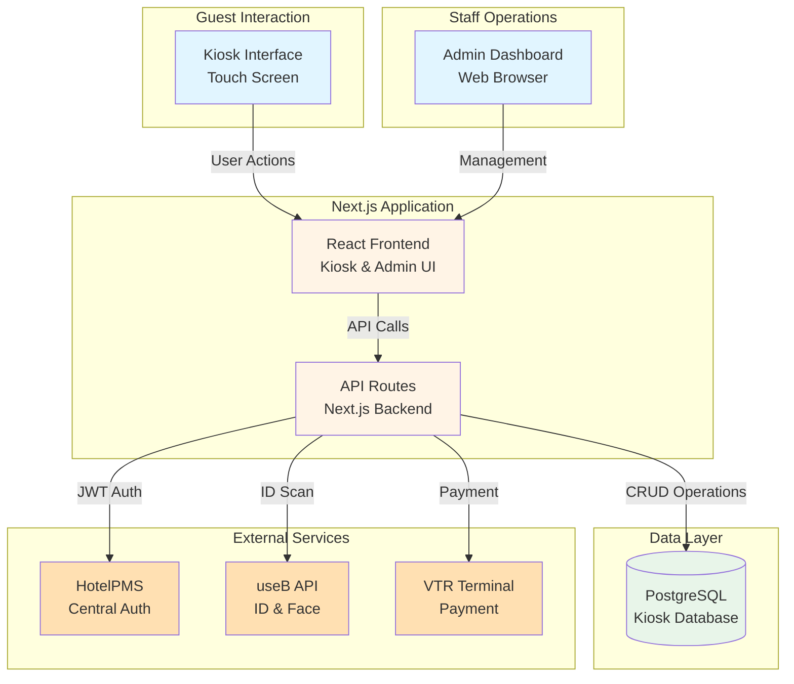
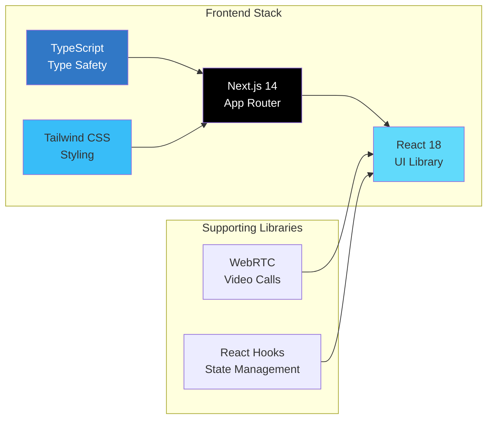
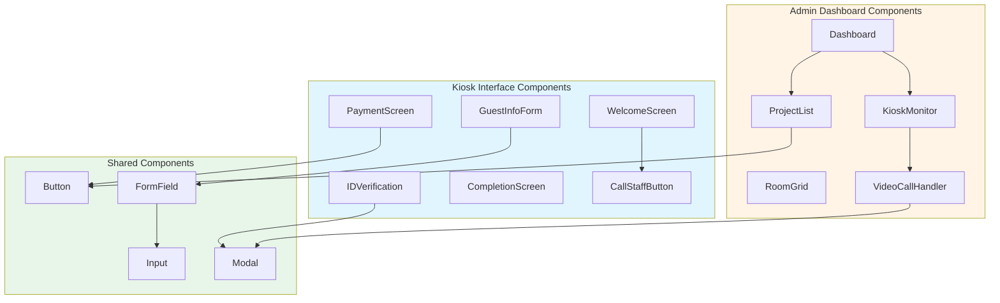
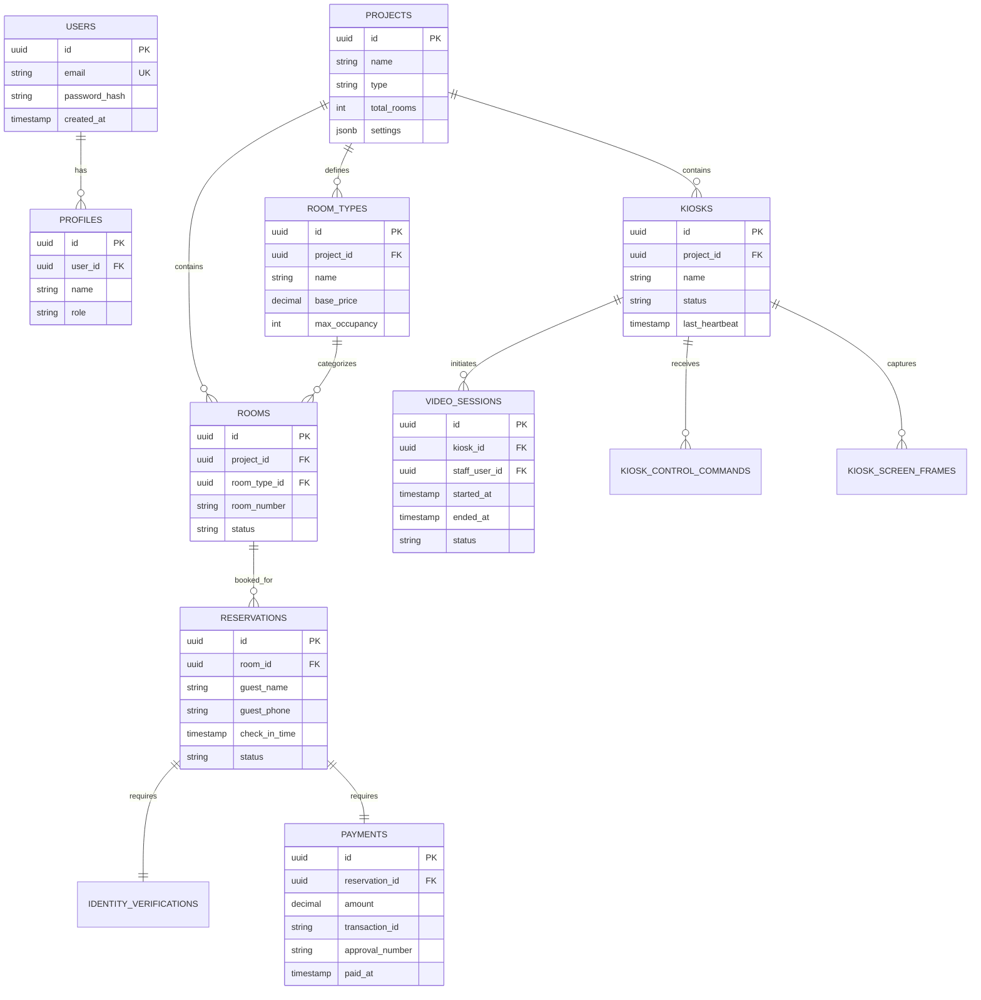
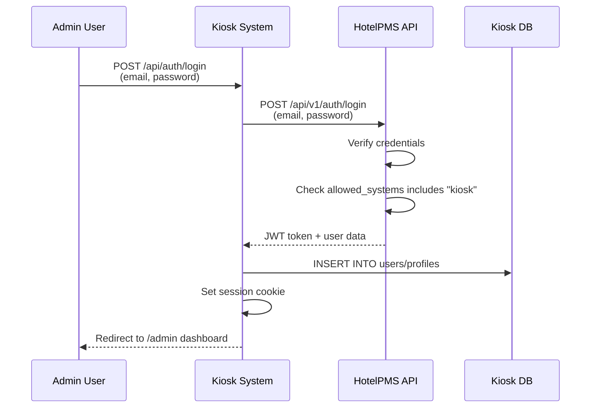
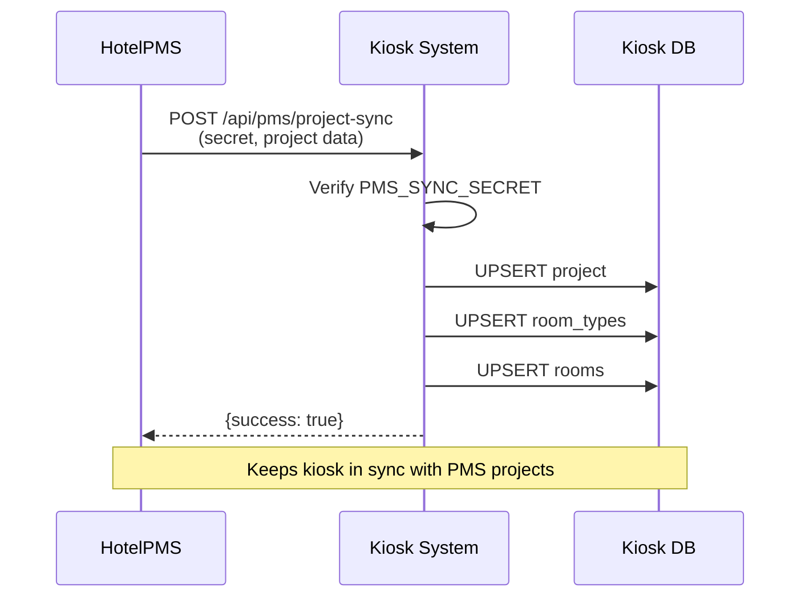
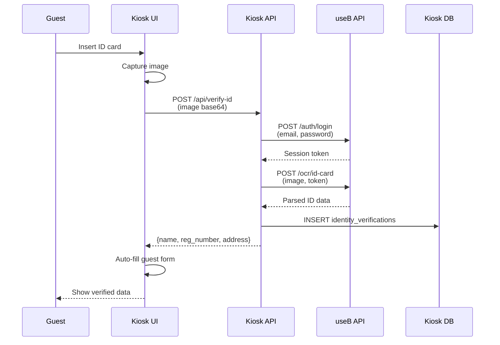
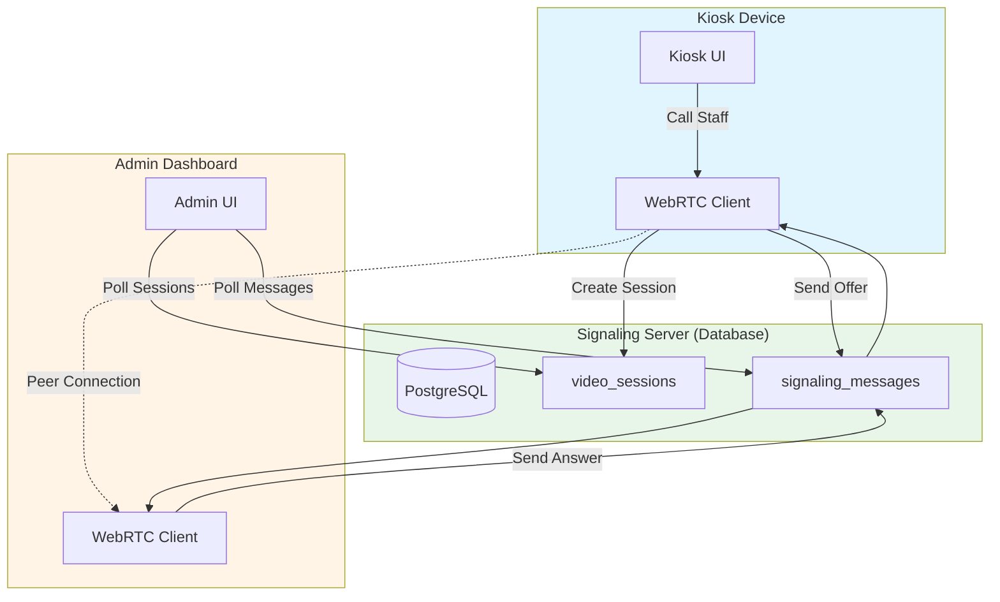
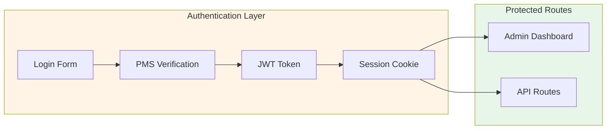

# Architecture - Kiosk System

Technical architecture and design of the Hotel Check-in Kiosk System.

## Table of Contents

1. [System Architecture](#system-architecture)
2. [Technology Stack](#technology-stack)
3. [Application Structure](#application-structure)
4. [Database Architecture](#database-architecture)
5. [Integration Architecture](#integration-architecture)
6. [Video Call Architecture](#video-call-architecture)
7. [Security Architecture](#security-architecture)

---

## System Architecture

### High-Level Overview



**Components**:
- **Kiosk Interface**: Guest-facing touchscreen UI
- **Admin Dashboard**: Staff management interface
- **Next.js Application**: Full-stack framework (frontend + API routes)
- **PostgreSQL**: Relational database
- **External Services**: PMS (auth), useB (ID/face), VTR (payment)

---

## Technology Stack

### Frontend



**Key Technologies**:

| Technology | Version | Purpose |
|-----------|---------|---------|
| Next.js | 14 (App Router) | Full-stack React framework |
| React | 18 | UI library |
| TypeScript | Latest | Type safety |
| Tailwind CSS | Latest | Utility-first styling |
| WebRTC | Native | Video call support |

**Why Next.js App Router?**
- Server-side rendering (SSR) for faster initial load
- API routes for backend logic (no separate server)
- File-based routing (`app/` directory)
- Built-in optimization (images, fonts, etc.)

---

### Backend

```mermaid
graph TB
    subgraph API["Next.js API Routes"]
        Auth[/api/auth]
        Projects[/api/projects]
        Kiosks[/api/kiosks]
        Rooms[/api/rooms]
        Video[/api/video]
        PMS_Sync[/api/pms/project-sync]
    end

    subgraph Database["PostgreSQL"]
        DB[(kiosk database<br/>13 tables)]
    end

    subgraph External["External APIs"]
        PMS_API[HotelPMS API<br/>JWT Auth]
        useB_API[useB API<br/>ID/Face]
        VTR_API[VTR Server<br/>Payment]
    end

    Auth --> DB
    Projects --> DB
    Kiosks --> DB
    Rooms --> DB
    Video --> DB

    Auth -.->|Verify User| PMS_API
    Projects -.->|Scan ID| useB_API
    Rooms -.->|Process Payment| VTR_API
    PMS_Sync -->|Sync Data| DB

    style API fill:#fff4e6
    style DB fill:#e8f5e9
    style External fill:#ffe0b2
```

**API Routes Structure**:
```
admin/app/api/
├── auth/
│   ├── login/route.ts          # PMS authentication
│   └── logout/route.ts         # Session cleanup
├── projects/
│   ├── route.ts                # List/create projects
│   └── [id]/route.ts           # Get/update/delete project
├── kiosks/
│   ├── route.ts                # List/create kiosks
│   └── [id]/route.ts           # Get/update kiosk
├── rooms/
│   ├── types/route.ts          # Room types
│   └── [id]/route.ts           # Individual room
├── video/
│   ├── sessions/route.ts       # Video call sessions
│   └── signaling/route.ts      # WebRTC signaling
└── pms/
    └── project-sync/route.ts   # PMS webhook
```

---

### Database

**PostgreSQL 14+**

**Connection**:
- Driver: `pg` (node-postgres)
- Connection pooling: Built-in Next.js
- Async queries: Promise-based

**Schema**: 13 tables (see [05-data-models.md](05-data-models.md))

---

## Application Structure

### Next.js App Router Structure

```
admin/
├── app/
│   ├── layout.tsx                    # Root layout
│   ├── page.tsx                      # Kiosk interface (/)
│   ├── admin/
│   │   ├── layout.tsx                # Admin dashboard layout
│   │   ├── page.tsx                  # Dashboard home
│   │   ├── projects/
│   │   │   ├── page.tsx              # Projects list
│   │   │   └── [id]/page.tsx         # Project details
│   │   ├── kiosks/
│   │   │   ├── page.tsx              # Kiosks list
│   │   │   └── [id]/page.tsx         # Kiosk details
│   │   ├── rooms/
│   │   │   └── page.tsx              # Room management
│   │   └── video/
│   │       └── page.tsx              # Video call handling
│   └── api/                          # API routes (as above)
├── components/
│   ├── kiosk/                        # Kiosk UI components
│   │   ├── WelcomeScreen.tsx
│   │   ├── GuestInfoForm.tsx
│   │   ├── IDVerification.tsx
│   │   ├── PaymentScreen.tsx
│   │   └── CompletionScreen.tsx
│   ├── admin/                        # Admin UI components
│   │   ├── Dashboard.tsx
│   │   ├── ProjectList.tsx
│   │   ├── KioskMonitor.tsx
│   │   └── VideoCall.tsx
│   └── shared/                       # Shared components
│       ├── Button.tsx
│       ├── Input.tsx
│       └── Modal.tsx
├── lib/
│   ├── db.ts                         # Database connection
│   ├── pms-auth.ts                   # PMS authentication
│   ├── useb-ocr.ts                   # useB ID OCR
│   ├── useb-face.ts                  # useB Face auth
│   └── payment.ts                    # VTR payment
├── types/
│   ├── user.ts                       # Type definitions
│   ├── project.ts
│   ├── kiosk.ts
│   └── room.ts
└── public/                           # Static assets
    ├── images/
    └── fonts/
```

---

### Component Architecture



---

## Database Architecture

### Schema Overview

**13 Tables**:

| Table | Purpose | Rows (Typical) |
|-------|---------|---------------|
| users | Authentication | 10-100 |
| profiles | User profiles | 10-100 |
| projects | Properties | 1-50 |
| kiosks | Kiosk devices | 1-100 |
| room_types | Room categories | 5-20 per project |
| rooms | Individual rooms | 10-500 per project |
| reservations | Guest bookings | 100-10,000 |
| video_sessions | Video calls | Active only (1-20) |
| signaling_messages | WebRTC signaling | Active only (10-100) |
| kiosk_control_commands | Remote commands | Recent only (10-50) |
| kiosk_screen_frames | Screen captures | Recent only (10-50) |
| identity_verifications | ID scans | 100-10,000 |
| payments | Transactions | 100-10,000 |

### Entity Relationships



**Key Relationships**:
- One project → Many kiosks, rooms, room types
- One room type → Many rooms
- One room → Many reservations (over time)
- One kiosk → Many video sessions
- One reservation → One ID verification
- One reservation → One payment

---

## Integration Architecture

### Authentication Flow



### Project Sync Flow



### ID Verification Flow



---

## Video Call Architecture

### WebRTC Architecture



**Signaling Process**:

1. **Kiosk initiates call**:
   - Creates `video_session` record
   - Sends WebRTC offer to `signaling_messages`

2. **Admin polls for new sessions**:
   - Polls every 2 seconds
   - Detects new session
   - Shows notification

3. **Admin answers call**:
   - Sends WebRTC answer to `signaling_messages`
   - Sends ICE candidates

4. **Peer connection established**:
   - Direct peer-to-peer video/audio
   - No media server (reduces cost)

5. **End call**:
   - Updates `video_session` status
   - Cleans up `signaling_messages`

**Why Polling Instead of WebSocket?**
- Simpler deployment (no WebSocket server)
- Works with standard HTTP/HTTPS
- Easier to scale (stateless API routes)
- Database-backed (survives server restarts)

---

## Security Architecture

### Authentication



**Security Layers**:

1. **PMS Authentication**:
   - All users authenticate via HotelPMS
   - PMS verifies credentials
   - PMS checks `allowed_systems` includes "kiosk"

2. **JWT Tokens**:
   - Issued by PMS
   - Stored in HTTP-only cookies
   - Expiry: 30 minutes (access token)

3. **Session Management**:
   - Local JWT_SECRET for admin sessions
   - Separate from PMS tokens
   - Auto-refresh on activity

4. **API Route Protection**:
   - Middleware checks session
   - Extracts user from JWT
   - Verifies permissions

### Data Encryption

**At Rest**:
- ID verification data: AES-256 encryption
- Payment data: Tokenized (no card data stored)
- Database: PostgreSQL native encryption (optional)

**In Transit**:
- HTTPS (TLS 1.2+) required in production
- WebRTC: DTLS (encrypted video/audio)

### Access Control

**Role-Based Access Control (RBAC)**:

| Role | Projects | Kiosks | Video Calls | Users |
|------|----------|--------|-------------|-------|
| super_admin | All | All | All | Manage |
| project_admin | Assigned | Assigned | Assigned | View |
| staff | Assigned | View only | Answer | View |
| kiosk | None | Self only | Initiate | None |

---

## Related Documentation

- [00 - Overview](00-overview.md) - System overview
- [05 - Data Models](05-data-models.md) - Database schema details
- [06 - Integrations](06-integrations.md) - External system integrations
- [07 - Flows](07-flows.md) - Workflow sequence diagrams

---

**Previous**: [← 00 - Overview](00-overview.md) | **Next**: [02 - Setup →](02-setup.md)
