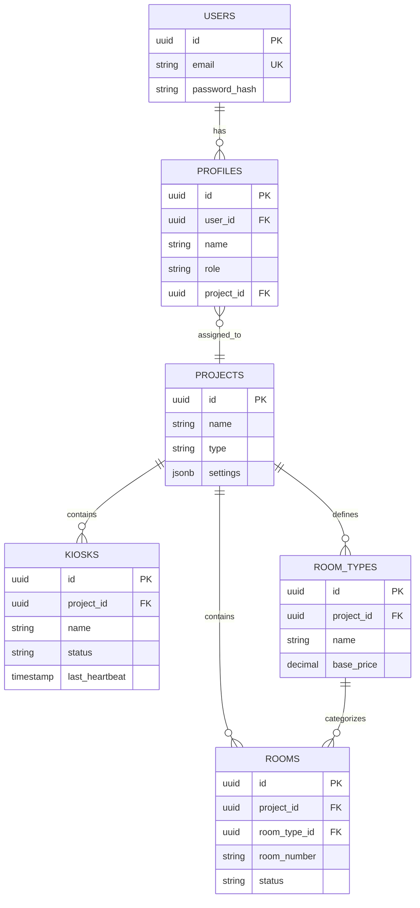
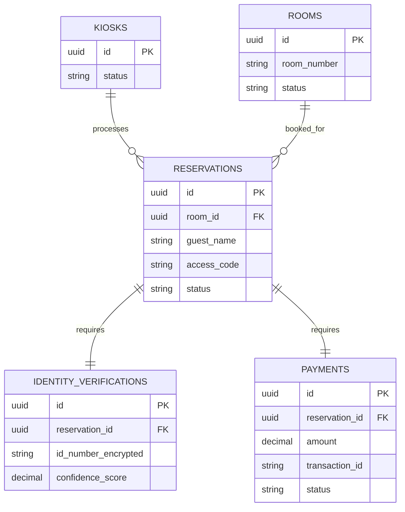
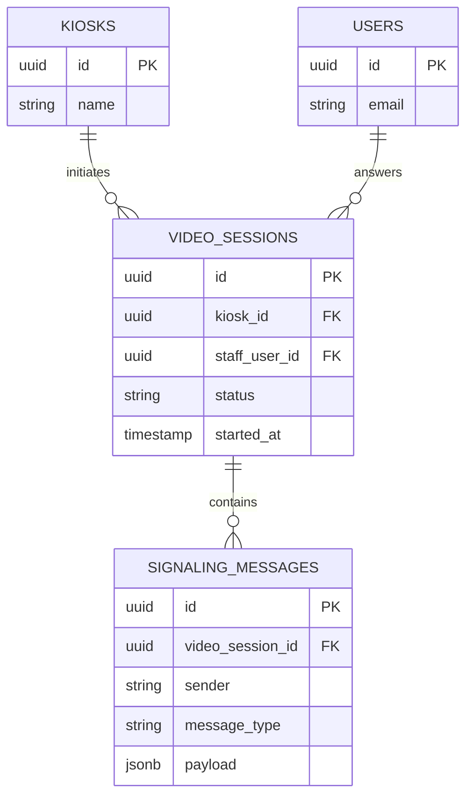

# Data Models - Kiosk System

Complete database schema documentation for the Hotel Check-in Kiosk System.

## Table of Contents

1. [Database Overview](#database-overview)
2. [Core Tables](#core-tables)
3. [Operational Tables](#operational-tables)
4. [Video Call Tables](#video-call-tables)
5. [Transaction Tables](#transaction-tables)
6. [Entity Relationships](#entity-relationships)
7. [Indexes and Constraints](#indexes-and-constraints)

---

## Database Overview

**Database**: `kiosk`
**Total Tables**: 13
**Primary Key Type**: UUID (universally unique identifiers)
**Timestamps**: All tables include `created_at` and `updated_at`

**Table Categories**:
- **Core**: users, profiles, projects, kiosks
- **Room Management**: room_types, rooms
- **Operational**: reservations, kiosk_control_commands, kiosk_screen_frames
- **Video Call**: video_sessions, signaling_messages
- **Transactions**: identity_verifications, payments

---

## Core Tables

### 1. users

**Purpose**: User authentication

```sql
CREATE TABLE users (
    id UUID PRIMARY KEY DEFAULT gen_random_uuid(),
    email VARCHAR(255) UNIQUE NOT NULL,
    password_hash VARCHAR(255) NOT NULL,
    created_at TIMESTAMP DEFAULT NOW(),
    updated_at TIMESTAMP DEFAULT NOW()
);
```

**Fields**:
- `id`: Unique user identifier
- `email`: User email (login username)
- `password_hash`: Bcrypt hashed password
- `created_at`: Account creation timestamp
- `updated_at`: Last update timestamp

**Indexes**:
- PRIMARY KEY on `id`
- UNIQUE index on `email`

**Notes**:
- Users authenticate via HotelPMS (primary)
- Local passwords for fallback/admin access

**Example**:
```json
{
  "id": "550e8400-e29b-41d4-a716-446655440000",
  "email": "admin@admin.com",
  "password_hash": "$2b$12$...",
  "created_at": "2024-01-01T00:00:00Z",
  "updated_at": "2024-01-01T00:00:00Z"
}
```

---

### 2. profiles

**Purpose**: User profiles and roles

```sql
CREATE TABLE profiles (
    id UUID PRIMARY KEY DEFAULT gen_random_uuid(),
    user_id UUID REFERENCES users(id) ON DELETE CASCADE,
    name VARCHAR(255),
    role VARCHAR(50),
    project_id UUID REFERENCES projects(id),
    created_at TIMESTAMP DEFAULT NOW(),
    updated_at TIMESTAMP DEFAULT NOW()
);
```

**Fields**:
- `id`: Profile identifier
- `user_id`: Foreign key to users table
- `name`: User display name
- `role`: User role (super_admin, project_admin, staff, kiosk)
- `project_id`: Assigned project (for project_admin/staff)

**Roles**:
- `super_admin`: Full system access
- `project_admin`: Single property management
- `staff`: Front desk operations
- `kiosk`: Kiosk device accounts

**Indexes**:
- PRIMARY KEY on `id`
- INDEX on `user_id`
- INDEX on `project_id`

---

### 3. projects

**Purpose**: Multi-property management

```sql
CREATE TABLE projects (
    id UUID PRIMARY KEY DEFAULT gen_random_uuid(),
    name VARCHAR(255) NOT NULL,
    type VARCHAR(50),
    address TEXT,
    total_rooms INTEGER,
    settings JSONB,
    created_at TIMESTAMP DEFAULT NOW(),
    updated_at TIMESTAMP DEFAULT NOW()
);
```

**Fields**:
- `id`: Project identifier
- `name`: Property name (e.g., "Seoul Hotel")
- `type`: Property type (hotel, pension, camping, f&b)
- `address`: Property address
- `total_rooms`: Total room count
- `settings`: JSON configuration (check-in/out times, policies)

**Settings JSON Example**:
```json
{
  "check_in_time": "15:00",
  "check_out_time": "11:00",
  "allow_early_checkin": true,
  "late_checkout_fee": 20000,
  "currency": "KRW"
}
```

---

### 4. kiosks

**Purpose**: Kiosk device registration and monitoring

```sql
CREATE TABLE kiosks (
    id UUID PRIMARY KEY DEFAULT gen_random_uuid(),
    project_id UUID REFERENCES projects(id) ON DELETE CASCADE,
    name VARCHAR(255) NOT NULL,
    location VARCHAR(255),
    status VARCHAR(50) DEFAULT 'offline',
    last_heartbeat TIMESTAMP,
    current_screen VARCHAR(100),
    hardware_info JSONB,
    created_at TIMESTAMP DEFAULT NOW(),
    updated_at TIMESTAMP DEFAULT NOW()
);
```

**Fields**:
- `id`: Kiosk identifier
- `project_id`: Assigned property
- `name`: Kiosk name (e.g., "Lobby Kiosk 1")
- `location`: Physical location
- `status`: online, offline, in_use, error
- `last_heartbeat`: Last ping timestamp
- `current_screen`: Current displayed screen
- `hardware_info`: Device specifications (JSON)

**Status Values**:
- `online`: Connected and ready
- `offline`: Disconnected
- `in_use`: Guest checking in
- `error`: Hardware/software issue

**Hardware Info JSON Example**:
```json
{
  "model": "Custom Kiosk v2",
  "serial_number": "KSK-2024-001",
  "os": "Windows 11",
  "screen_size": "24 inches",
  "ip_address": "192.168.1.100"
}
```

**Heartbeat**:
- Kiosk sends heartbeat every 30 seconds
- If no heartbeat for 60 seconds → status = offline

---

## Operational Tables

### 5. room_types

**Purpose**: Room category definitions

```sql
CREATE TABLE room_types (
    id UUID PRIMARY KEY DEFAULT gen_random_uuid(),
    project_id UUID REFERENCES projects(id) ON DELETE CASCADE,
    name VARCHAR(100) NOT NULL,
    description TEXT,
    base_price DECIMAL(10, 2),
    max_occupancy INTEGER,
    amenities JSONB,
    images JSONB,
    created_at TIMESTAMP DEFAULT NOW(),
    updated_at TIMESTAMP DEFAULT NOW()
);
```

**Fields**:
- `id`: Room type identifier
- `project_id`: Property
- `name`: Type name (Standard, Deluxe, Suite)
- `description`: Type description
- `base_price`: Base nightly rate
- `max_occupancy`: Maximum guests
- `amenities`: List of amenities (JSON)
- `images`: Image URLs (JSON)

**Amenities JSON Example**:
```json
{
  "amenities": ["WiFi", "TV", "Air Conditioning", "Mini Bar", "Safe"],
  "bed_type": "Queen",
  "size_sqm": 30
}
```

---

### 6. rooms

**Purpose**: Individual room inventory

```sql
CREATE TABLE rooms (
    id UUID PRIMARY KEY DEFAULT gen_random_uuid(),
    project_id UUID REFERENCES projects(id) ON DELETE CASCADE,
    room_type_id UUID REFERENCES room_types(id),
    room_number VARCHAR(50) NOT NULL,
    floor INTEGER,
    status VARCHAR(50) DEFAULT 'available',
    notes TEXT,
    created_at TIMESTAMP DEFAULT NOW(),
    updated_at TIMESTAMP DEFAULT NOW()
);
```

**Fields**:
- `id`: Room identifier
- `project_id`: Property
- `room_type_id`: Room category
- `room_number`: Room number (101, 102, etc.)
- `floor`: Floor number
- `status`: available, occupied, cleaning, maintenance, blocked
- `notes`: Special notes

**Status Values**:
- `available`: Ready for check-in
- `occupied`: Guest currently staying
- `cleaning`: Being cleaned
- `maintenance`: Out of service
- `blocked`: Administratively blocked

---

### 7. reservations

**Purpose**: Guest bookings and check-ins

```sql
CREATE TABLE reservations (
    id UUID PRIMARY KEY DEFAULT gen_random_uuid(),
    room_id UUID REFERENCES rooms(id),
    project_id UUID REFERENCES projects(id),
    guest_name VARCHAR(255) NOT NULL,
    guest_phone VARCHAR(50) NOT NULL,
    guest_email VARCHAR(255),
    number_of_guests INTEGER DEFAULT 1,
    check_in_time TIMESTAMP,
    check_out_time TIMESTAMP,
    access_code VARCHAR(20),
    status VARCHAR(50) DEFAULT 'pending',
    created_at TIMESTAMP DEFAULT NOW(),
    updated_at TIMESTAMP DEFAULT NOW()
);
```

**Fields**:
- `id`: Reservation identifier
- `room_id`: Assigned room
- `project_id`: Property
- `guest_name`: Guest name
- `guest_phone`: Guest phone
- `guest_email`: Guest email (optional)
- `number_of_guests`: Guest count
- `check_in_time`: Check-in timestamp
- `check_out_time`: Check-out timestamp (for multi-night)
- `access_code`: Room access PIN/code
- `status`: pending, confirmed, completed, cancelled

**Access Code**:
- 4-6 digit PIN for door lock
- Generated automatically
- Displayed on completion screen

---

### 8. kiosk_control_commands

**Purpose**: Remote kiosk control

```sql
CREATE TABLE kiosk_control_commands (
    id UUID PRIMARY KEY DEFAULT gen_random_uuid(),
    kiosk_id UUID REFERENCES kiosks(id) ON DELETE CASCADE,
    command VARCHAR(100) NOT NULL,
    parameters JSONB,
    status VARCHAR(50) DEFAULT 'pending',
    executed_at TIMESTAMP,
    created_at TIMESTAMP DEFAULT NOW()
);
```

**Fields**:
- `id`: Command identifier
- `kiosk_id`: Target kiosk
- `command`: Command name
- `parameters`: Command parameters (JSON)
- `status`: pending, executed, failed
- `executed_at`: Execution timestamp

**Commands**:
- `restart`: Restart kiosk app
- `clear_session`: Clear current check-in session
- `go_to_welcome`: Navigate to welcome screen
- `display_message`: Show message to guest
- `update_config`: Update kiosk settings

**Example**:
```json
{
  "command": "display_message",
  "parameters": {
    "message": "System maintenance in 10 minutes. Please complete check-in.",
    "duration_seconds": 30
  }
}
```

---

### 9. kiosk_screen_frames

**Purpose**: Screen streaming for remote monitoring

```sql
CREATE TABLE kiosk_screen_frames (
    id UUID PRIMARY KEY DEFAULT gen_random_uuid(),
    kiosk_id UUID REFERENCES kiosks(id) ON DELETE CASCADE,
    screen_data TEXT,
    created_at TIMESTAMP DEFAULT NOW()
);
```

**Fields**:
- `id`: Frame identifier
- `kiosk_id`: Source kiosk
- `screen_data`: Base64 encoded screenshot
- `created_at`: Capture timestamp

**Usage**:
- Kiosk sends screenshot every 5 seconds (configurable)
- Admin dashboard displays real-time screen
- Old frames auto-deleted after 5 minutes

---

## Video Call Tables

### 10. video_sessions

**Purpose**: Video call session management

```sql
CREATE TABLE video_sessions (
    id UUID PRIMARY KEY DEFAULT gen_random_uuid(),
    kiosk_id UUID REFERENCES kiosks(id) ON DELETE CASCADE,
    staff_user_id UUID REFERENCES users(id),
    status VARCHAR(50) DEFAULT 'pending',
    started_at TIMESTAMP DEFAULT NOW(),
    ended_at TIMESTAMP,
    duration_seconds INTEGER,
    created_at TIMESTAMP DEFAULT NOW(),
    updated_at TIMESTAMP DEFAULT NOW()
);
```

**Fields**:
- `id`: Session identifier
- `kiosk_id`: Kiosk initiating call
- `staff_user_id`: Staff member who answered
- `status`: pending, active, ended
- `started_at`: Call start time
- `ended_at`: Call end time
- `duration_seconds`: Call duration

**Lifecycle**:
1. Guest taps "Call Staff" → status = `pending`
2. Staff answers → status = `active`, set `staff_user_id`
3. Either party ends call → status = `ended`, set `ended_at`

---

### 11. signaling_messages

**Purpose**: WebRTC signaling (offer, answer, ICE candidates)

```sql
CREATE TABLE signaling_messages (
    id UUID PRIMARY KEY DEFAULT gen_random_uuid(),
    video_session_id UUID REFERENCES video_sessions(id) ON DELETE CASCADE,
    sender VARCHAR(50) NOT NULL,
    message_type VARCHAR(50) NOT NULL,
    payload JSONB NOT NULL,
    created_at TIMESTAMP DEFAULT NOW()
);
```

**Fields**:
- `id`: Message identifier
- `video_session_id`: Related video session
- `sender`: kiosk or staff
- `message_type`: offer, answer, ice_candidate
- `payload`: WebRTC signaling data (JSON)
- `created_at`: Message timestamp

**Message Types**:
- `offer`: WebRTC offer (from kiosk)
- `answer`: WebRTC answer (from staff)
- `ice_candidate`: ICE candidate (from either)

**Payload Example (offer)**:
```json
{
  "type": "offer",
  "sdp": "v=0\r\no=- 123456789 2 IN IP4 127.0.0.1\r\n..."
}
```

**Cleanup**:
- Messages auto-deleted when session ends
- Prevents database bloat

---

## Transaction Tables

### 12. identity_verifications

**Purpose**: ID verification records

```sql
CREATE TABLE identity_verifications (
    id UUID PRIMARY KEY DEFAULT gen_random_uuid(),
    reservation_id UUID REFERENCES reservations(id) ON DELETE CASCADE,
    id_type VARCHAR(50) NOT NULL,
    id_number_encrypted TEXT,
    name VARCHAR(255),
    address TEXT,
    verification_method VARCHAR(50),
    confidence_score DECIMAL(3, 2),
    id_image_url TEXT,
    created_at TIMESTAMP DEFAULT NOW()
);
```

**Fields**:
- `id`: Verification identifier
- `reservation_id`: Related reservation
- `id_type`: korean_id, passport, driver_license
- `id_number_encrypted`: Encrypted ID number (AES-256)
- `name`: Name from ID
- `address`: Address from ID
- `verification_method`: ocr, manual, face_auth
- `confidence_score`: OCR confidence (0.00-1.00)
- `id_image_url`: Encrypted image storage URL

**Security**:
- ID numbers encrypted at rest (AES-256)
- Images stored encrypted
- Access logged
- Auto-delete after retention period (configurable, default 90 days)

**Verification Methods**:
- `ocr`: useB OCR API
- `manual`: Staff manual entry
- `face_auth`: useB Face authentication

---

### 13. payments

**Purpose**: Payment transactions

```sql
CREATE TABLE payments (
    id UUID PRIMARY KEY DEFAULT gen_random_uuid(),
    reservation_id UUID REFERENCES reservations(id) ON DELETE CASCADE,
    amount DECIMAL(10, 2) NOT NULL,
    currency VARCHAR(3) DEFAULT 'KRW',
    payment_method VARCHAR(50),
    transaction_id VARCHAR(100) UNIQUE,
    approval_number VARCHAR(100),
    card_number_masked VARCHAR(50),
    status VARCHAR(50) DEFAULT 'pending',
    paid_at TIMESTAMP,
    created_at TIMESTAMP DEFAULT NOW(),
    updated_at TIMESTAMP DEFAULT NOW()
);
```

**Fields**:
- `id`: Payment identifier
- `reservation_id`: Related reservation
- `amount`: Payment amount
- `currency`: Currency code (KRW, USD, etc.)
- `payment_method`: card, cash, prepaid
- `transaction_id`: Unique transaction ID (from VTR)
- `approval_number`: Card approval number
- `card_number_masked`: Masked card number (1234-****-****-5678)
- `status`: pending, completed, failed, refunded
- `paid_at`: Payment timestamp

**Security**:
- **PCI Compliance**: No full card numbers stored
- Only masked card numbers (last 4 digits)
- Transaction IDs for reference
- Payment processing via VTR terminal (secure)

**Payment Methods**:
- `card`: Credit/debit card (VTR terminal)
- `cash`: Cash payment (staff desk)
- `prepaid`: Already paid online

---

## Entity Relationships

### Core Entities



### Operational Flow



### Video Call System



---

## Indexes and Constraints

### Primary Keys

All tables use UUID primary keys:
```sql
id UUID PRIMARY KEY DEFAULT gen_random_uuid()
```

**Benefits**:
- Globally unique (no collisions across projects)
- Non-sequential (security)
- Distributed-friendly (sharding support)

### Foreign Keys

**CASCADE Deletes**:
- Deleting a project → deletes all kiosks, rooms, room_types
- Deleting a user → deletes profiles
- Deleting a reservation → deletes ID verification, payment

**Example**:
```sql
project_id UUID REFERENCES projects(id) ON DELETE CASCADE
```

### Indexes

**Performance Indexes**:
```sql
-- Email lookup (login)
CREATE INDEX idx_users_email ON users(email);

-- User profile lookup
CREATE INDEX idx_profiles_user_id ON profiles(user_id);

-- Project queries
CREATE INDEX idx_kiosks_project_id ON kiosks(project_id);
CREATE INDEX idx_rooms_project_id ON rooms(project_id);

-- Room availability
CREATE INDEX idx_rooms_status ON rooms(status);

-- Reservation queries
CREATE INDEX idx_reservations_room_id ON reservations(room_id);
CREATE INDEX idx_reservations_status ON reservations(status);

-- Video session polling
CREATE INDEX idx_video_sessions_status ON video_sessions(status);
CREATE INDEX idx_signaling_messages_session_id ON signaling_messages(video_session_id);
```

### Unique Constraints

```sql
-- Prevent duplicate emails
UNIQUE (email) ON users

-- Prevent duplicate room numbers per project
UNIQUE (project_id, room_number) ON rooms

-- Prevent duplicate transaction IDs
UNIQUE (transaction_id) ON payments
```

---

## Related Documentation

- [01 - Architecture](01-architecture.md) - System architecture
- [06 - Integrations](06-integrations.md) - External system integrations
- [07 - Flows](07-flows.md) - Workflow diagrams

---

**Previous**: [← 04 - Features](04-features.md) | **Next**: [06 - Integrations →](06-integrations.md)
