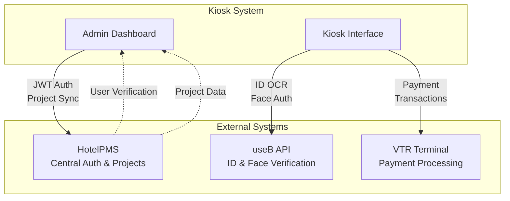
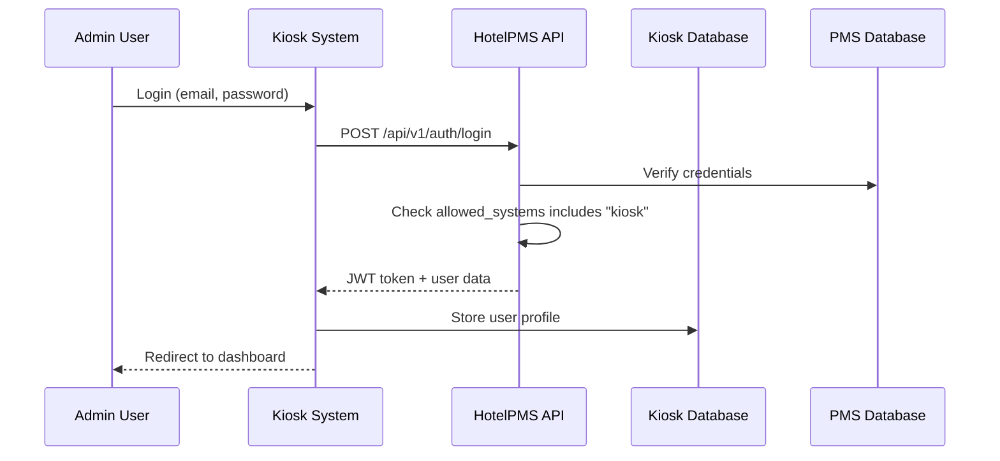
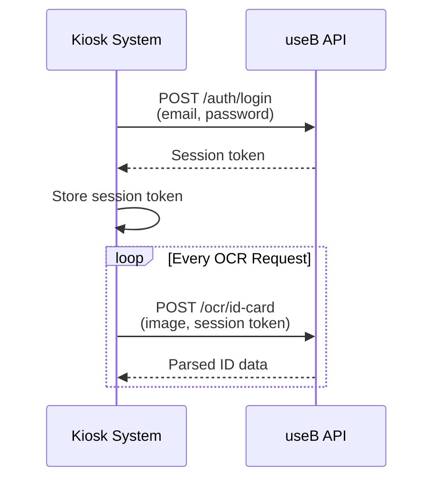
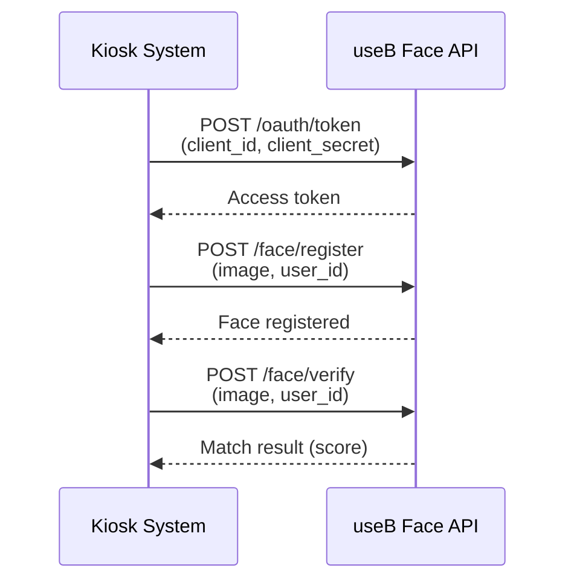
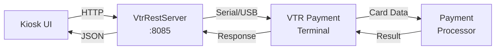

# Integrations - Kiosk System

Complete reference for all external system integrations in the Hotel Check-in Kiosk System.

## Table of Contents

1. [Integration Overview](#integration-overview)
2. [HotelPMS Integration](#hotelpms-integration)
3. [useB API Integration](#useb-api-integration)
4. [VTR Payment Terminal Integration](#vtr-payment-terminal-integration)
5. [Integration Patterns](#integration-patterns)
6. [Troubleshooting](#troubleshooting)

---

## Integration Overview

The Kiosk System integrates with three main external systems:



| Integration | Purpose | Required | Protocol |
|------------|---------|----------|----------|
| HotelPMS | Authentication, Project Management | ✅ Yes | REST API (JWT) |
| useB API | ID Verification, Face Recognition | ✅ Yes | REST API (Email/Password) |
| VTR Terminal | Payment Processing | ✅ Yes | HTTP API (VtrRestServer) |

---

## HotelPMS Integration

### Overview

**HotelPMS** serves as the **central authentication provider** for the Kiosk System. All admin users authenticate through PMS, and project data is synchronized from PMS.

### Architecture



### Configuration

**Environment Variable**:
```env
# Local
PMS_AUTH_URL=http://localhost:8000

# Production
PMS_AUTH_URL=https://pmsapi.hio.ai.kr
```

**Location**: `admin/.env`

### API Endpoints

#### 1. User Authentication

**Endpoint**: `POST {PMS_AUTH_URL}/api/v1/auth/login`

**Request**:
```json
{
  "email": "admin@pms.com",
  "password": "secure_password"
}
```

**Response** (Success):
```json
{
  "access_token": "eyJhbGciOiJIUzI1NiIsInR5cCI6IkpXVCJ9...",
  "refresh_token": "eyJhbGciOiJIUzI1NiIsInR5cCI6IkpXVCJ9...",
  "token_type": "bearer",
  "user": {
    "id": "uuid",
    "email": "admin@pms.com",
    "name": "Admin User",
    "allowed_systems": ["pms", "kiosk", "cctv"]
  }
}
```

**Response** (Error - Not Allowed):
```json
{
  "detail": "User does not have access to kiosk system"
}
```

**Kiosk Implementation**:
```typescript
// lib/pms-auth.ts
export async function loginWithPMS(email: string, password: string) {
  const response = await fetch(`${process.env.PMS_AUTH_URL}/api/v1/auth/login`, {
    method: 'POST',
    headers: { 'Content-Type': 'application/json' },
    body: JSON.stringify({ email, password })
  });

  if (!response.ok) {
    throw new Error('PMS authentication failed');
  }

  const data = await response.json();

  // Check if user has kiosk access
  if (!data.user.allowed_systems.includes('kiosk')) {
    throw new Error('User does not have access to kiosk system');
  }

  return data;
}
```

#### 2. Token Refresh

**Endpoint**: `POST {PMS_AUTH_URL}/api/v1/auth/refresh`

**Request**:
```json
{
  "refresh_token": "eyJhbGciOiJIUzI1NiIsInR5cCI6IkpXVCJ9..."
}
```

**Response**:
```json
{
  "access_token": "eyJhbGciOiJIUzI1NiIsInR5cCI6IkpXVCJ9...",
  "token_type": "bearer"
}
```

#### 3. User Verification

**Endpoint**: `GET {PMS_AUTH_URL}/api/v1/auth/me`

**Headers**:
```
Authorization: Bearer {access_token}
```

**Response**:
```json
{
  "id": "uuid",
  "email": "admin@pms.com",
  "name": "Admin User",
  "allowed_systems": ["pms", "kiosk"],
  "projects": [
    {
      "id": "uuid",
      "name": "Seoul Hotel",
      "role": "project_admin"
    }
  ]
}
```

### Project Synchronization

**PMS → Kiosk Sync Webhook**

When projects are created/updated in PMS, they can be synced to Kiosk via webhook.

**Endpoint**: `POST /api/pms/project-sync`

**Request** (from PMS):
```json
{
  "secret": "pms-kiosk-sync-2026",
  "project": {
    "id": "uuid",
    "name": "Seoul Hotel",
    "type": "hotel",
    "address": "123 Seoul Street",
    "total_rooms": 50,
    "settings": {
      "check_in_time": "15:00",
      "check_out_time": "11:00"
    },
    "room_types": [
      {
        "id": "uuid",
        "name": "Standard",
        "base_price": 100000,
        "max_occupancy": 2
      }
    ],
    "rooms": [
      {
        "id": "uuid",
        "room_number": "101",
        "room_type_id": "uuid",
        "status": "available"
      }
    ]
  }
}
```

**Kiosk Implementation**:
```typescript
// pages/api/pms/project-sync.ts
export default async function handler(req, res) {
  if (req.method !== 'POST') {
    return res.status(405).json({ error: 'Method not allowed' });
  }

  const { secret, project } = req.body;

  // Verify sync secret
  if (secret !== process.env.PMS_SYNC_SECRET) {
    return res.status(401).json({ error: 'Invalid sync secret' });
  }

  // Sync project to kiosk database
  await db.query(
    'INSERT INTO projects (id, name, type, settings) VALUES ($1, $2, $3, $4) ON CONFLICT (id) DO UPDATE SET name=$2, settings=$4',
    [project.id, project.name, project.type, project.settings]
  );

  // Sync room types
  for (const roomType of project.room_types) {
    await db.query(
      'INSERT INTO room_types (id, project_id, name, base_price, max_occupancy) VALUES ($1, $2, $3, $4, $5) ON CONFLICT (id) DO UPDATE SET name=$3, base_price=$4',
      [roomType.id, project.id, roomType.name, roomType.base_price, roomType.max_occupancy]
    );
  }

  // Sync rooms
  for (const room of project.rooms) {
    await db.query(
      'INSERT INTO rooms (id, project_id, room_number, room_type_id, status) VALUES ($1, $2, $3, $4, $5) ON CONFLICT (id) DO UPDATE SET room_number=$3, status=$5',
      [room.id, project.id, room.room_number, room.room_type_id, room.status]
    );
  }

  res.status(200).json({ success: true });
}
```

### Access Control

**User Permissions**:
- User must have `"kiosk"` in `allowed_systems` array
- Roles supported: `super_admin`, `project_admin`, `staff`, `kiosk`

**PMS Configuration** (for kiosk access):
```sql
-- Grant kiosk access to user
UPDATE users SET allowed_systems = ARRAY['pms', 'kiosk'] WHERE email = 'admin@pms.com';

-- Verify
SELECT email, allowed_systems FROM users WHERE 'kiosk' = ANY(allowed_systems);
```

### Error Handling

**Common Errors**:

| Error | Cause | Solution |
|-------|-------|----------|
| Connection refused | PMS not running | Start HotelPMS backend |
| 401 Unauthorized | Invalid credentials | Verify email/password |
| 403 Forbidden | No kiosk access | Add `"kiosk"` to `allowed_systems` |
| 404 Not Found | Wrong PMS_AUTH_URL | Check PMS URL in .env |

---

## useB API Integration

### Overview

**useB** provides two key services:
1. **ID Card OCR** - Korean ID card scanning and verification
2. **Face Authentication** - Biometric verification

### Configuration

**Environment Variables**:
```env
# useB Account Credentials
USEB_EMAIL=test_stayg.dev@gmail.com
USEB_PASSWORD="stayg.dev251215!@#"

# useB Face Server
FACE_CLIENT_ID=6tm6s6pts8lo3tks5lksjpbb5h
FACE_CLIENT_SECRET=1tddlv9krucj399s4njr6kc57th2ithi9bubj2r5hoa3u0olbq2m
```

### ID Card OCR Integration

#### Authentication Flow



#### API Endpoints

**1. Login**

**Endpoint**: `POST https://api.useb.co.kr/auth/login`

**Request**:
```json
{
  "email": "test_stayg.dev@gmail.com",
  "password": "stayg.dev251215!@#"
}
```

**Response**:
```json
{
  "token": "eyJhbGciOiJIUzI1NiIsInR5cCI6IkpXVCJ9...",
  "expires_at": "2024-01-01T00:00:00Z"
}
```

**2. ID Card OCR**

**Endpoint**: `POST https://api.useb.co.kr/ocr/id-card`

**Request**:
```json
{
  "image": "data:image/jpeg;base64,/9j/4AAQSkZJRg...",
  "type": "korean_id"
}
```

**Headers**:
```
Authorization: Bearer {token}
Content-Type: application/json
```

**Response** (Success):
```json
{
  "success": true,
  "data": {
    "name": "홍길동",
    "registration_number": "901234-1******",
    "address": "서울특별시 강남구 테헤란로 123",
    "issue_date": "2020-01-01",
    "confidence": 0.95
  }
}
```

**Response** (Error):
```json
{
  "success": false,
  "error": "Invalid image format"
}
```

#### Kiosk Implementation

```typescript
// lib/useb-ocr.ts
let usebToken: string | null = null;

async function getUseBToken() {
  if (usebToken) return usebToken;

  const response = await fetch('https://api.useb.co.kr/auth/login', {
    method: 'POST',
    headers: { 'Content-Type': 'application/json' },
    body: JSON.stringify({
      email: process.env.USEB_EMAIL,
      password: process.env.USEB_PASSWORD
    })
  });

  const data = await response.json();
  usebToken = data.token;

  // Refresh token before expiry
  setTimeout(() => { usebToken = null; }, 3600000); // 1 hour

  return usebToken;
}

export async function scanIDCard(imageBase64: string) {
  const token = await getUseBToken();

  const response = await fetch('https://api.useb.co.kr/ocr/id-card', {
    method: 'POST',
    headers: {
      'Authorization': `Bearer ${token}`,
      'Content-Type': 'application/json'
    },
    body: JSON.stringify({
      image: imageBase64,
      type: 'korean_id'
    })
  });

  const result = await response.json();

  if (!result.success) {
    throw new Error(result.error || 'ID scanning failed');
  }

  return result.data;
}
```

### Face Authentication Integration

#### Authentication Flow



#### API Endpoints

**1. OAuth Token**

**Endpoint**: `POST https://face.useb.co.kr/oauth/token`

**Request**:
```json
{
  "client_id": "6tm6s6pts8lo3tks5lksjpbb5h",
  "client_secret": "1tddlv9krucj399s4njr6kc57th2ithi9bubj2r5hoa3u0olbq2m",
  "grant_type": "client_credentials"
}
```

**Response**:
```json
{
  "access_token": "eyJhbGciOiJIUzI1NiIsInR5cCI6IkpXVCJ9...",
  "token_type": "bearer",
  "expires_in": 3600
}
```

**2. Face Registration**

**Endpoint**: `POST https://face.useb.co.kr/face/register`

**Request**:
```json
{
  "user_id": "guest_12345",
  "image": "data:image/jpeg;base64,/9j/4AAQSkZJRg...",
  "quality_check": true
}
```

**Response**:
```json
{
  "success": true,
  "face_id": "uuid",
  "quality_score": 0.92
}
```

**3. Face Verification**

**Endpoint**: `POST https://face.useb.co.kr/face/verify`

**Request**:
```json
{
  "user_id": "guest_12345",
  "image": "data:image/jpeg;base64,/9j/4AAQSkZJRg..."
}
```

**Response**:
```json
{
  "success": true,
  "match": true,
  "score": 0.98,
  "threshold": 0.80
}
```

### useB Best Practices

1. **Token Caching**:
   - Cache useB tokens (1 hour expiry)
   - Refresh tokens before expiry
   - Handle token expiration errors

2. **Image Quality**:
   - Minimum resolution: 640x480
   - Format: JPEG, PNG
   - Lighting: Good front lighting
   - Face detection: Use library to detect face first

3. **Error Handling**:
   - Network timeouts (30s max)
   - Retry failed requests (3 attempts max)
   - Fallback to manual entry if OCR fails

4. **Privacy Compliance**:
   - Delete face images after verification
   - Encrypt ID data in database
   - Log access to ID verification records

---

## VTR Payment Terminal Integration

### Overview

**VTR Payment Terminal** handles credit card transactions via a separate server (VtrRestServer) that communicates with physical payment terminals.

### Architecture



### Configuration

**Environment Variable**:
```env
NEXT_PUBLIC_PAYMENT_AGENT_URL=http://localhost:8085
```

**VtrRestServer Location**:
- Typically runs on kiosk device (localhost:8085)
- Or centralized server (http://payment-server:8085)

### API Endpoints

#### 1. Payment Request

**Endpoint**: `POST {PAYMENT_AGENT_URL}/payment`

**Request**:
```json
{
  "amount": 100000,
  "currency": "KRW",
  "transaction_id": "kiosk_tx_12345",
  "description": "Room 101 - Standard (1 night)"
}
```

**Response** (Success):
```json
{
  "success": true,
  "transaction_id": "kiosk_tx_12345",
  "approval_number": "12345678",
  "card_number_masked": "1234-****-****-5678",
  "amount": 100000,
  "timestamp": "2024-01-01T12:00:00Z"
}
```

**Response** (Declined):
```json
{
  "success": false,
  "error_code": "CARD_DECLINED",
  "error_message": "Insufficient funds"
}
```

#### 2. Payment Cancellation

**Endpoint**: `POST {PAYMENT_AGENT_URL}/cancel`

**Request**:
```json
{
  "transaction_id": "kiosk_tx_12345",
  "approval_number": "12345678",
  "amount": 100000
}
```

**Response**:
```json
{
  "success": true,
  "cancelled_transaction_id": "kiosk_tx_12345",
  "cancellation_id": "cancel_67890"
}
```

### Kiosk Implementation

```typescript
// lib/payment.ts
export async function processPayment(amount: number, description: string) {
  const transactionId = `kiosk_tx_${Date.now()}`;

  const response = await fetch(`${process.env.NEXT_PUBLIC_PAYMENT_AGENT_URL}/payment`, {
    method: 'POST',
    headers: { 'Content-Type': 'application/json' },
    body: JSON.stringify({
      amount,
      currency: 'KRW',
      transaction_id: transactionId,
      description
    })
  });

  const result = await response.json();

  if (!result.success) {
    throw new Error(result.error_message || 'Payment failed');
  }

  // Save to database
  await db.query(
    'INSERT INTO payments (transaction_id, approval_number, amount, status) VALUES ($1, $2, $3, $4)',
    [result.transaction_id, result.approval_number, result.amount, 'completed']
  );

  return result;
}
```

### Payment Flow

1. **Guest selects payment**
2. **Kiosk displays amount**
3. **Guest inserts card into VTR terminal**
4. **Kiosk sends payment request** → VtrRestServer
5. **VtrRestServer communicates** with physical terminal (serial/USB)
6. **Terminal processes card** with payment processor
7. **Terminal returns result** to VtrRestServer
8. **VtrRestServer returns JSON** to kiosk
9. **Kiosk displays success/failure**

**Timeout**: 60 seconds (configurable)

### VTR Terminal Setup

1. **Install VtrRestServer** on kiosk device
2. **Connect VTR terminal** via serial or USB
3. **Configure COM port** in VtrRestServer config
4. **Start VtrRestServer**:
   ```powershell
   VtrRestServer.exe --port 8085 --com COM3
   ```
5. **Test connection**:
   ```powershell
   curl http://localhost:8085/status
   ```

**Expected Response**:
```json
{
  "status": "ready",
  "terminal_connected": true,
  "port": "COM3"
}
```

### Error Handling

**Common Payment Errors**:

| Error Code | Meaning | Action |
|-----------|---------|--------|
| CARD_DECLINED | Insufficient funds or limit | Ask guest to use another card |
| TERMINAL_ERROR | Hardware failure | Call staff, use backup kiosk |
| TIMEOUT | No response from terminal | Retry payment |
| NETWORK_ERROR | VtrRestServer unreachable | Check server status |

---

## Integration Patterns

### Graceful Fallbacks

**PMS Unavailable**:
- Display error: "Authentication service unavailable"
- Provide staff contact info
- Allow local admin login (if configured)

**useB Unavailable**:
- Allow manual ID entry
- Flag for staff verification
- Continue check-in with warnings

**VTR Unavailable**:
- Offer alternative payment (cash, external POS)
- Allow "pay at checkout" option
- Call staff for assistance

### Retry Logic

```typescript
async function withRetry(fn: () => Promise<any>, maxRetries = 3) {
  for (let i = 0; i < maxRetries; i++) {
    try {
      return await fn();
    } catch (error) {
      if (i === maxRetries - 1) throw error;
      await sleep(1000 * Math.pow(2, i)); // Exponential backoff
    }
  }
}

// Usage
const result = await withRetry(() => scanIDCard(imageBase64));
```

### Health Checks

```typescript
// pages/api/health.ts
export default async function handler(req, res) {
  const health = {
    pms: false,
    useb: false,
    payment: false
  };

  try {
    const pmsRes = await fetch(`${process.env.PMS_AUTH_URL}/api/v1/health`, { timeout: 5000 });
    health.pms = pmsRes.ok;
  } catch {}

  try {
    const token = await getUseBToken();
    health.useb = !!token;
  } catch {}

  try {
    const paymentRes = await fetch(`${process.env.NEXT_PUBLIC_PAYMENT_AGENT_URL}/status`, { timeout: 5000 });
    health.payment = paymentRes.ok;
  } catch {}

  res.status(200).json(health);
}
```

---

## Troubleshooting

### PMS Integration Issues

**Cannot connect to PMS**:
1. Verify PMS is running: `curl http://localhost:8000/docs`
2. Check `PMS_AUTH_URL` in `.env`
3. Check firewall/network connectivity

**User not authorized for kiosk**:
```sql
-- In PMS database
UPDATE users SET allowed_systems = ARRAY['pms', 'kiosk'] WHERE email = 'user@example.com';
```

### useB Integration Issues

**ID OCR failing**:
1. Check image quality (lighting, resolution)
2. Verify useB credentials
3. Test with sample images
4. Check useB service status

**Face authentication failing**:
1. Verify FACE_CLIENT_ID and FACE_CLIENT_SECRET
2. Ensure adequate lighting for camera
3. Test OAuth token generation
4. Check face quality score

### VTR Payment Issues

**Terminal not responding**:
1. Check VtrRestServer is running
2. Verify COM port configuration
3. Restart VtrRestServer
4. Check terminal power and connection

**Payment timeout**:
1. Increase timeout to 90 seconds
2. Check terminal network connection (if networked terminal)
3. Test with small amount ($0.01)

---

## Related Documentation

- [03 - Environment Variables](03-env.md) - Integration configuration
- [07 - Flows](07-flows.md) - Integration workflows
- [09 - Troubleshooting](09-troubleshooting.md) - Common issues

---

**Previous**: [← 05 - Data Models](05-data-models.md) | **Next**: [07 - Flows →](07-flows.md)
