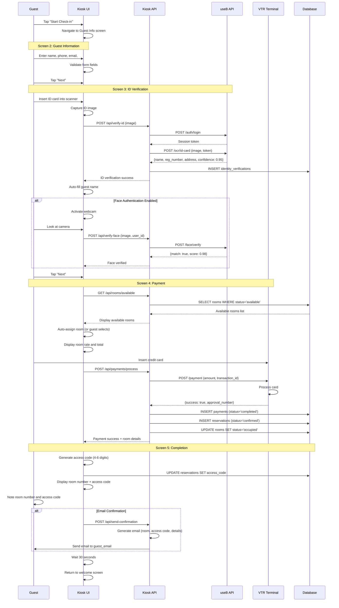
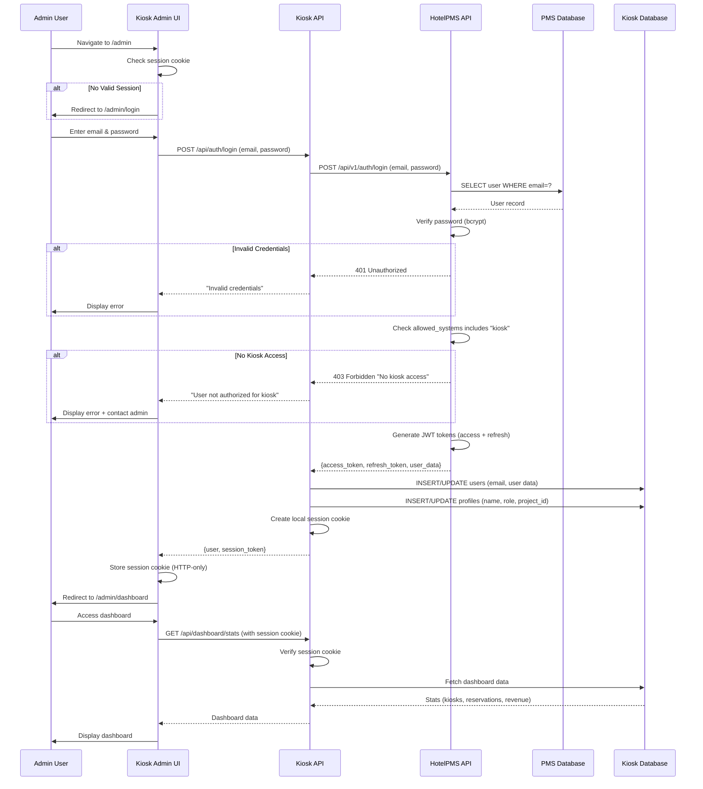
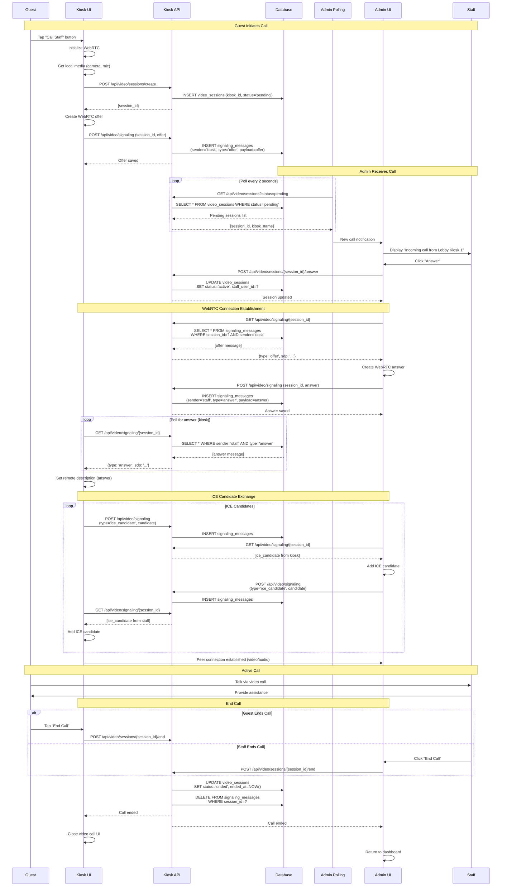
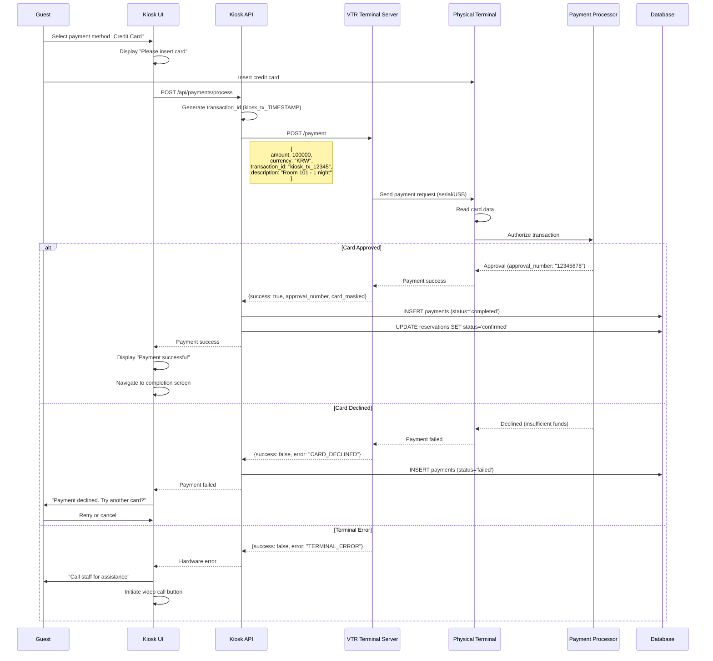
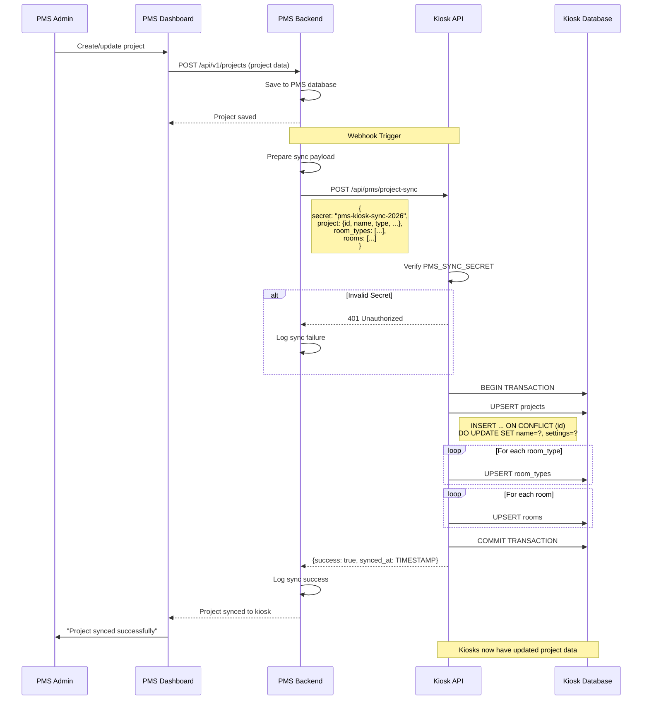

# Workflows - Kiosk System

End-to-end workflow documentation with sequence diagrams for the Hotel Check-in Kiosk System.

## Table of Contents

1. [Guest Check-in Flow](#guest-check-in-flow)
2. [Admin Login Flow](#admin-login-flow)
3. [Video Call Flow](#video-call-flow)
4. [Payment Processing Flow](#payment-processing-flow)
5. [ID Verification Flow](#id-verification-flow)
6. [Project Sync Flow](#project-sync-flow)

---

## Guest Check-in Flow

### Complete Check-in Sequence



**Key Steps**:
1. Welcome → Start check-in
2. Guest Info → Enter personal details
3. ID Verification → Scan ID + optional face auth
4. Payment → Process payment + assign room
5. Completion → Display room number + access code

**Duration**: 3-5 minutes average

---

## Admin Login Flow

### PMS Authentication



**Important**:
- Primary authentication via HotelPMS (central provider)
- User must have `"kiosk"` in PMS `allowed_systems` array
- Local session cookie for subsequent requests
- JWT token refresh handled automatically

---

## Video Call Flow

### WebRTC Signaling via Database



**Key Points**:
- **Polling-based signaling** (no WebSocket required)
- **Database stores** WebRTC offer/answer/ICE candidates
- **Peer-to-peer** video/audio (after connection established)
- **Automatic cleanup** of signaling messages after call ends

---

## Payment Processing Flow

### VTR Terminal Payment



**Error Handling**:
- **Card Declined**: Allow retry with different card
- **Terminal Error**: Prompt to call staff
- **Timeout** (60s): Display timeout message, allow retry
- **Network Error**: Retry 3 times with exponential backoff

---

## ID Verification Flow

### useB ID OCR + Face Authentication

```mermaid
sequenceDiagram
    participant Guest
    participant Kiosk as Kiosk UI
    participant API as Kiosk API
    participant useB_OCR as useB OCR API
    participant useB_Face as useB Face API
    participant DB as Database

    Note over Guest,DB: Step 1: ID Card Scanning

    Guest->>Kiosk: Insert ID card into scanner
    Kiosk->>Kiosk: Capture ID card image (JPEG)
    Kiosk->>Kiosk: Convert to base64
    Kiosk->>API: POST /api/verify-id (image_base64)

    API->>API: Check cached useB token

    alt No Token Cached
        API->>useB_OCR: POST /auth/login (email, password)
        useB_OCR-->>API: {token, expires_at}
        API->>API: Cache token (1 hour)
    end

    API->>useB_OCR: POST /ocr/id-card
    Note right of API: Headers: Authorization: Bearer {token}<br/>Body: {image: "data:image/jpeg;base64,...", type: "korean_id"}

    useB_OCR->>useB_OCR: Perform OCR

    alt OCR Success
        useB_OCR-->>API: {success: true, data: {name, reg_number, address}, confidence: 0.95}

        API->>DB: INSERT identity_verifications<br/>(id_number_encrypted, name, address, confidence)
        API-->>Kiosk: {verified: true, data: {...}}

        Kiosk->>Kiosk: Auto-fill guest name field
        Kiosk->>Guest: "ID verified successfully"

    else OCR Failed (poor quality)
        useB_OCR-->>API: {success: false, error: "Low confidence"}
        API-->>Kiosk: {verified: false, error: "Please rescan ID"}
        Kiosk->>Guest: "ID scan failed. Please try again"
        Guest->>Kiosk: Retry or manual entry

    else OCR Error (network/API)
        useB_OCR-->>API: 500 Server Error
        API-->>Kiosk: {verified: false, error: "Service unavailable"}
        Kiosk->>Guest: "Verification service unavailable. Enter manually?"
        Guest->>Kiosk: Manual entry
        API->>DB: INSERT identity_verifications (method='manual')
    end

    Note over Guest,DB: Step 2: Face Authentication (Optional)

    alt Face Auth Enabled
        Kiosk->>Kiosk: Activate webcam
        Kiosk->>Guest: "Please look at the camera"
        Guest->>Kiosk: Face camera
        Kiosk->>Kiosk: Capture face image
        Kiosk->>API: POST /api/verify-face (user_id, face_image)

        API->>useB_Face: POST /oauth/token (client_id, client_secret)
        useB_Face-->>API: {access_token}

        API->>useB_Face: POST /face/register (user_id, id_image)
        useB_Face-->>API: {face_id}

        API->>useB_Face: POST /face/verify (user_id, face_image)
        useB_Face-->>API: {match: true, score: 0.98, threshold: 0.80}

        alt Face Match
            API->>DB: UPDATE identity_verifications SET face_verified=true
            API-->>Kiosk: Face verified
            Kiosk->>Guest: "Face verified successfully"
        else Face Mismatch
            API-->>Kiosk: Face mismatch (score < threshold)
            Kiosk->>Guest: "Face verification failed. Call staff?"
            Kiosk->>Kiosk: Enable "Call Staff" button
        end
    end

    Kiosk->>Kiosk: Proceed to payment screen
```

**Fallback Strategy**:
1. **ID OCR fails** → Allow manual entry (staff verification flag set)
2. **Face auth fails** → Continue without face verification (optional feature)
3. **useB service unavailable** → Manual entry + staff verification required

---

## Project Sync Flow

### PMS → Kiosk Synchronization



**Sync Triggers**:
- Project created
- Project updated (name, settings, etc.)
- Room types added/updated
- Rooms added/updated

**Security**:
- Shared secret (`PMS_SYNC_SECRET`) for authentication
- Must match in both PMS and Kiosk `.env`

---

## Related Documentation

- [00 - Overview](00-overview.md) - System overview
- [01 - Architecture](01-architecture.md) - Technical architecture
- [04 - Features](04-features.md) - Feature documentation
- [06 - Integrations](06-integrations.md) - External integrations

---

**Previous**: [← 06 - Integrations](06-integrations.md) | **Next**: [08 - Deployment →](08-deployment.md)
